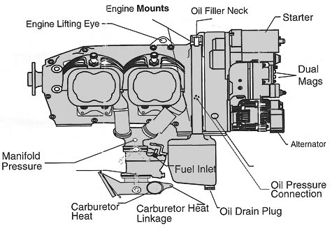

Engine Upkeep
-------------

How do Engines Break?

  * Run out of gas
  * Run out of oil
  * Non-maintainance
    * preflight inspection
    * preflight runup

1. Intake
2. Compression
3. Power
4. Exhast

Airplanes use high octane fuel for a slower burn. 100LL (blue) has 9:4:1 compression ratio

Magneto

  * The Magneto is a tuning magnet on a coil that produces the spark to ignite the gasoline
  * Has a gear to point to the correct spark plug
  * Runs until grounded - even if lead breaks or ignition breaks, the magneto will continue running

**_Never turn a propeller clockwise (from pilot's view) by hand, magneto might still be on and engine might do a combustion cycle. Turn it backwards instead_**

