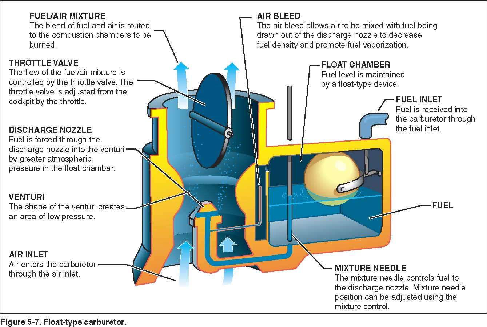

Induction
----------

Controls the amount of fuel and air that goes into the Engine

*Always stop the plane by turning the mixture leaner and leaner so no fuel is left in the cylinder*

Stochiometric

* Oxygen and fuel are in perfect balance, this is the most efficent configuration
* nice to hit, but not necessary
* turn mixture until RPM starts to lower, that's about where this point is

Carburator
----------

The carb is located at the bottom for safety - if it leaks nothing would catch on fire

But it could ice over due to humidity and evaporation

  * This can even happen in summer
  * If this happens throttle could get stuck
  * we can turn on carb heat to redirect exhaust to carb
    * this lowers power and soots up the engine
  * Full power + rich mix + carb heat = detonation

Muffler
-------

Exhaust goes into this. If the mffler leaks, it could dump exhaust into the cabin

*If there's a funny smell, turn off the heat*

Fuel Injection
--------------

alternative to the carb system so we don't have to worry about carb ice. But costs a lot more

Sprays fuel to each cylinder constantly, better efficency and distribution. Easier to start when cold harder to start when hot

