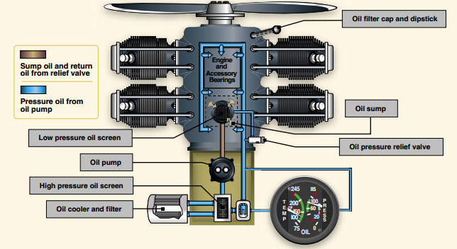

Lubrication System
------------------

Oil keeps the engine cool, without it engine would meltdown

  * Eliminates friction
  * Carries heat to oil cooler

Oil Filter also has bypass valve when the filter is dirty, so dirty filter would not cause meltdown

Has to be Aviation Oil

  * Any Aviation Oil can be mixed with any other

How to Cool the Engine

  1. Pull throttle back
  2. Mixtures (ratio of gas to air)
    * Lots of fuel -> rich mixture, burns cool
    * Lots of air -> lean mixture, burns hot
  3. Go faster and let air cool the engine
  4. Go Lower - denser air means more air molecules to carry heat away
  5. Turn on carburator heat -> richens fuel mix
