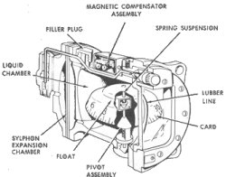

Compass
-------

Turning Error
-------------

When the aircraft is in a banked turn, the card also banks because of centrifugal force. And in this attitude, the vertical component of the Earth's magnetic field causes the compass to dip to the low side of the turn.

This compass turning error is most apparent when turning through headings close to north and south. When the aircraft makes a turn from a heading of north, the compass briefly indicates a turn in the opposite direction. When the aircraft makes a turn from a heading of south, the compass indicates a turn in the correct direction but at a considerably faster rate than is actually occurring.

Thus, when making a 360° right turn beginning at north, the card initially turns in the wrong direction; then, as the aircraft passes through East, the compass "catches up" with the actual heading. Passing through South, the compass leads the turn considerably. As the aircraft heading passes through West, the compass should approximate the correct heading. Then, as the aircraft heading approaches North again, the compass lags.

To compensate for this error and turn on headings you should overshoot turns on northerly and undershoot on southerly headings to maximum of 30° on a heading of 360° or 180°. Rolling out on a heading of 090° or 270° requires no compensation for this turning error.

Can be trusted in _straight and level_ _unaccelerated_ flight.

REMEMBER: THE SOUTH LEADS AND THE NORTH LAGS and

Acceleration Error
------------------

THERE IS NO ACCELERATION / DECELERATION ERROR ON A NORTH OR SOUTH HEADING.

ACCELERATE NORTH, DEACCELERATION SOUTH