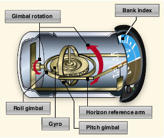
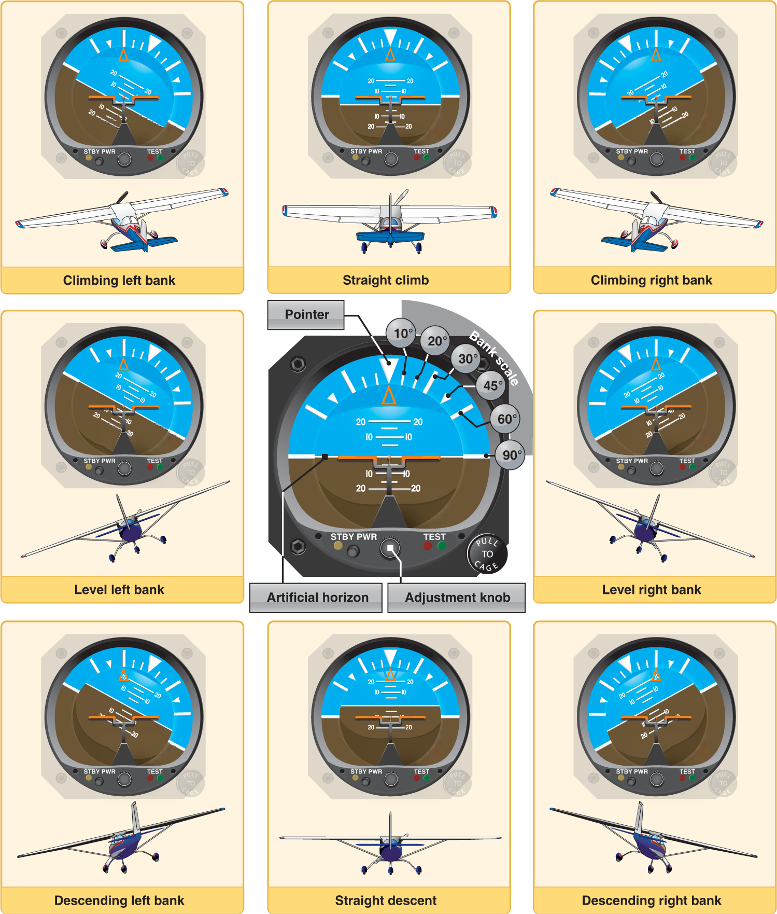
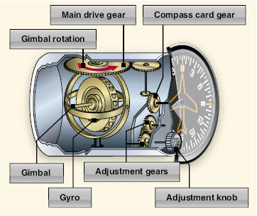
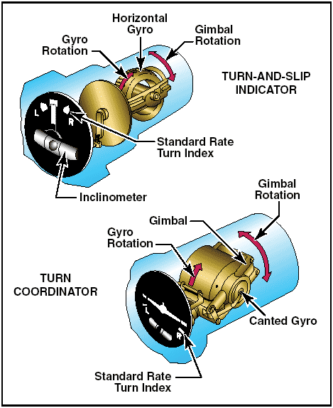

Gyroscopic
----------

Driven by a spinning gyroscope

Atitude Indicator
-----------------

  * No precession since air is blowing from 2 orthogonal directions to drive the Gyro
  * If vacuum pump breaks
    * ???
  * If bearing wear out
    * precession fixed by pendulun on airnozzle
    * if turning then it corrects wrong
    * if flat then is self corrects

Heading Indicator
-----------------

  * Does not measure roll (gimbled out to ignore one dirction of motion)
  * Have to reset every so often
  * Depending on the direction of the gyro spin, can be affected by the earth's motions
    * The heading indicator works using a gyroscope, tied by an erection mechanism to the aircraft yawing plane, any configuration of the aircraft yawing plane that does not match the local Earth horizontal results in an indication error.
  * If Bearings fail
    * Precession
  * If vac fails
    * stops working

Turn Coordinator
----------------

  * Rate instrument that measures how fast the nose of the airplane is turning (rate of yaw on horizon)
    * measure how far the nose is moving along the horizon degrees in 2 minutes
    * standard is 360 in 2 minutes
  * does not show bank angle, shows _rate_ of degree in 2 minutes