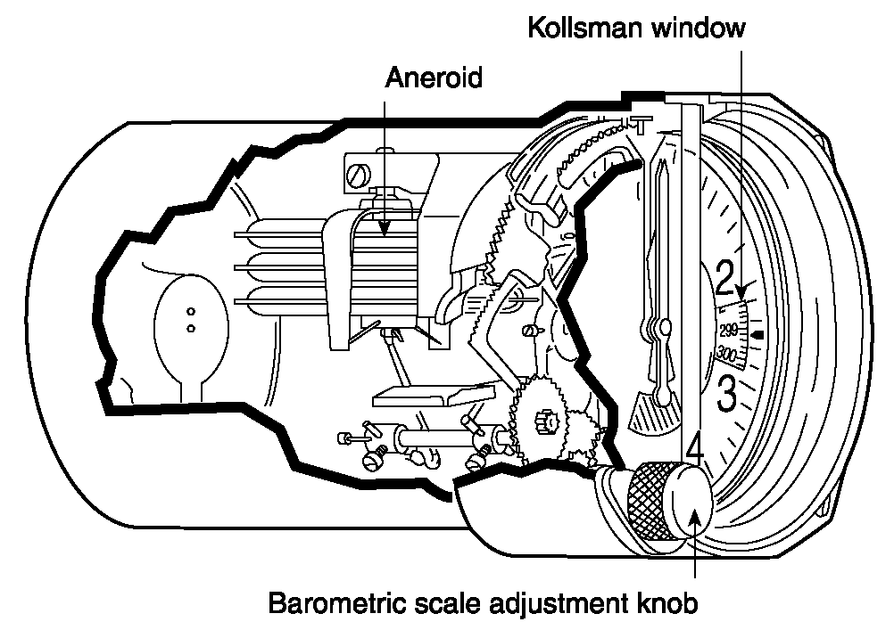

Pitot Static Instruments
------------------------

Driven by static pressure outside or pitot pressure inside

Airspeed Indicator
------------------

  * measured difference in pressure
  * don't blow on it _ever_
  * If pitot tube is blocked
    * airspeed indicator becomes altimiter
    * inaccurate at very high altitute
    * show a higher speed at a higher altitude
  * If static tube is blocked
    * Shows a higher speed at a lower altitude

Altimeter
---------

  * Kollsman window - altimter adjustment window
  * Adjustment know moves anaroid chamiber back and forth to set a baseline for altitude pressure
  * If static is blocked
    * stops moving
  * If static is partially clogged
    * Slowed response to altitude change

Vertical Speed Indicator
------------------------

  * Measure rate of leak between anaroid and body
  * If calibrated leak is clogged
    * overestimate vertical speed
  * If static is clogged
    * vertical speed will remain at 0
